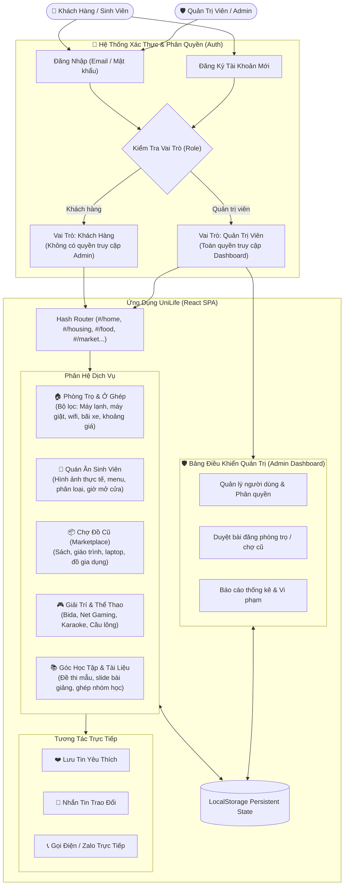
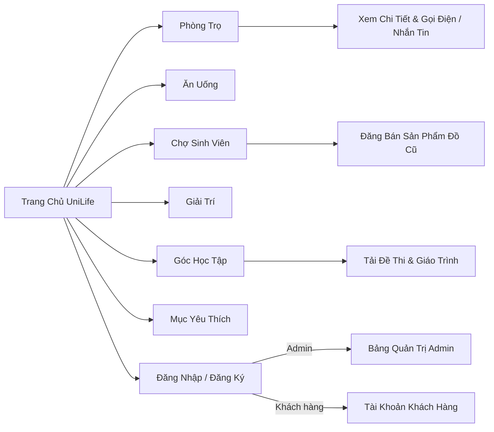

# 🎓 UniLife - Nền Tảng Hỗ Trợ Đời Sống Sinh Viên

[](https://gitdiagram.com/bin0106/PHANTRIDUC24CT1-CNPM)
[](https://github.com/bin0106/PHANTRIDUC24CT1-CNPM)

UniLife là ứng dụng Web tất-cả-trong-một (All-in-One Platform) dành cho sinh viên, hỗ trợ tìm trọ, quán ăn, trao đổi mua bán đồ cũ, địa điểm vui chơi giải trí và tài liệu học tập.

> 📊 **Xem sơ đồ cấu trúc GitDiagram:** Nhấp vào đường link [https://gitdiagram.com/bin0106/PHANTRIDUC24CT1-CNPM](https://gitdiagram.com/bin0106/PHANTRIDUC24CT1-CNPM) để xem trực quan toàn bộ sơ đồ thư mục và cây cấu trúc code của dự án.

---

## 🗺️ Sơ Đồ Kiến Trúc & Luồng Hệ Thống (Architecture Flow)



---

## 🧭 Sơ Đồ Điều Hướng Ứng Dụng (Navigation Flow)



---

## 👥 Tài Khoản Trải Nghiệm Hệ Thống

Hệ thống hỗ trợ đăng nhập nhanh với 2 phân quyền:

| Phân quyền | Email đăng nhập | Mật khẩu | Quyền hạn |
| :--- | :--- | :--- | :--- |
| **Khách hàng (User)** | `khachhang@gmail.com` | `123456` | Tìm trọ, xem quán ăn, đăng tin chợ cũ, nhắn tin trao đổi, lưu yêu thích (không vào được Admin). |
| **Quản trị viên (Admin)** | `admin@unilife.vn` | `admin123` | Toàn quyền quản trị hệ thống, quản lý người dùng, duyệt tin đăng, xem thống kê. |

*Bạn cũng có thể bấm vào tab **Đăng ký** để tạo tài khoản Khách hàng mới bất kỳ lúc nào.*

---

## ✨ Tính Năng Nổi Bật

- **Phân quyền người dùng & Khách hàng:** Đăng nhập, đăng ký tài khoản khách hàng, bảo vệ khu vực quản trị nghiêm ngặt.
- **Hình ảnh thực tế sinh động:** Tích hợp bộ sưu tập hình ảnh phòng trọ, quán ăn, sản phẩm chợ đồ cũ và tụ điểm giải trí.
- **Tìm trọ thông minh:** Lọc theo mức giá, máy lạnh, máy giặt, wifi, bãi xe, vị trí.
- **Ăn uống & Giải trí:** Tổng hợp các địa điểm chuẩn tiêu chí ngon - bổ - rẻ kèm giờ mở cửa và đánh giá sao.
- **Chợ đồ cũ:** Đăng tin thanh lý sách vở, giáo trình, đồ điện tử nhanh chóng.
- **Tương tác trực tiếp:** Tích hợp hộp thoại nhắn tin trao đổi và liên hệ trực tiếp cho từng bài đăng.
- **Lưu dữ liệu Offline/Local:** Sử dụng `usePersistentState` lưu trữ trực tiếp trên trình duyệt, không mất dữ liệu khi tải lại trang (F5).
- **Hoạt động độc lập (Standalone):** Đã đóng gói sẵn bản build production (`index.html` và `assets/`), có thể chạy ngay với bất kỳ web server nào hoặc GitHub Pages.

---

## 🚀 Hướng Dẫn Chạy Sản Phẩm

### 1. Chạy trực tiếp (Bản độc lập đã build sẵn)
Chỉ cần mở file `index.html` trong trình duyệt hoặc thông qua Live Server / GitHub Pages.

### 2. Môi trường phát triển (Development)
```bash
# Cài đặt thư viện phụ thuộc
npm install

# Khởi chạy server phát triển
npm run dev
```

### 3. Đóng gói cho Production
```bash
npm run build
```
Bản build tối ưu sẽ được xuất ra thư mục `dist/`.

---

## 🛠️ Công Nghệ Sử Dụng

- **Frontend Core:** [React 18](https://react.dev/) + [Vite](https://vitejs.dev/)
- **Icon Library:** [Lucide React](https://lucide.dev/)
- **Sơ đồ kiến trúc:** [Mermaid.js](https://mermaid.js.org/) & [GitDiagram](https://gitdiagram.com/)
- **Quản lý phiên bản:** Git & GitHub

---

© 2026 UniLife — Nền tảng tiện ích kết nối toàn diện đời sống sinh viên.
