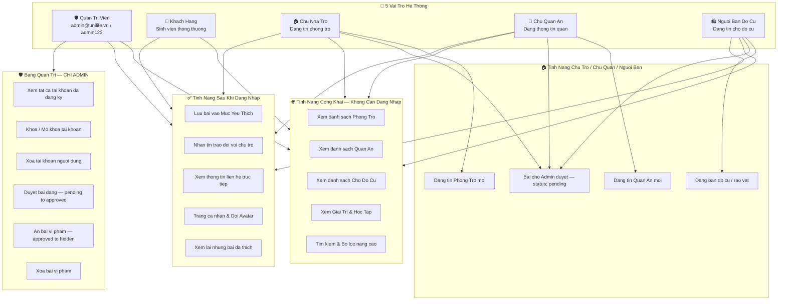
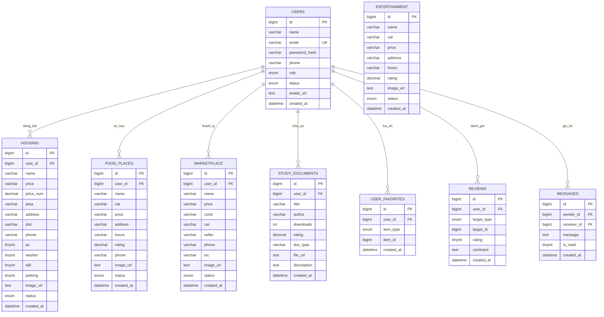

# 🎓 UniLife — Nền Tảng Hỗ Trợ Đời Sống Sinh Viên

[](https://github.com/bin0106/PHANTRIDUC24CT1-CNPM)
[](https://gitdiagram.com/bin0106/PHANTRIDUC24CT1-CNPM)
[](https://gitingest.com/bin0106/PHANTRIDUC24CT1-CNPM)

UniLife la ung dung Web tat-ca-trong-mot (All-in-One Platform) danh cho sinh vien, ho tro tim tro, quan an, trao doi mua ban do cu, dia diem vui choi giai tri va tai lieu hoc tap.

---

## 🗺️ Kien Truc Tong Quan (Architecture Overview)

```mermaid
flowchart TD
    subgraph Frontend["⚛️ Frontend — React 18 + Vite (SPA)"]
        A["src/App.jsx — Dieu huong & State toan cuc"]

        subgraph Data["src/data/ — Du lieu & Hang so"]
            D1["theme.js — Bang mau, tab config"]
            D2["initialData.js — Du lieu mau"]
        end

        subgraph Hooks["src/hooks/ — Custom React Hooks"]
            H1["usePersistentState.js — Luu LocalStorage"]
        end

        subgraph Services["src/services/ — Xu ly Nghiep vu (Business Logic)"]
            S1["authService.js — Dang nhap / Dang ky / Kiem tra quyen"]
            S2["postService.js — Duyet / An / Xoa bai dang"]
            S3["userService.js — Quan ly tai khoan nguoi dung"]
        end

        subgraph Components["src/components/ — Thanh phan giao dien tai su dung"]
            C1["common/ — Badge, StarRow, FavButton, FilterChip..."]
            C2["cards/ — PlaceCard, FoodCard, ProductCard, EntCard"]
            C3["modals/ — AuthModal, DetailModal, ChatModal, AddModal..."]
        end

        subgraph Views["src/views/ — Man hinh chinh (Pages)"]
            V1["HomeView.jsx — Trang chu"]
            V2["HousingView.jsx — Phong tro"]
            V3["FoodView.jsx — Quan an"]
            V4["MarketView.jsx — Cho do cu"]
            V5["EntertainmentView.jsx — Giai tri"]
            V6["StudyView.jsx — Hoc tap"]
            V7["FavoritesView.jsx — Yeu thich"]
            V8["ProfileView.jsx — Trang ca nhan"]
            V9["AdminView.jsx — Quan tri (chi Admin)"]
        end
    end

    subgraph Database["🗄️ database/ — Co So Du Lieu MySQL"]
        DB1["unilife_database.sql — DDL + Du lieu mau 9 bang"]
        DB2["CSDL_DESIGN.md — ERD + Tu dien du lieu"]
        DB3["setup_database.bat — Script tu dong import"]
    end

    A --> Services
    A --> Views
    Services --> Data
    Services --> Hooks
    Views --> Components
```



---

## 🔐 Phan Quyen Nguoi Dung (Role-Based Access Control)



---

## 🗄️ Co So Du Lieu — So Do ERD (Entity-Relationship Diagram)

> **File SQL:** [`database/unilife_database.sql`](./database/unilife_database.sql)
> **Tai lieu thiet ke:** [`database/CSDL_DESIGN.md`](./database/CSDL_DESIGN.md)
> **Script tu dong:** [`database/setup_database.bat`](./database/setup_database.bat)



**9 Bang CSDL:**

| Bang | Mo ta | Quan he |
|------|-------|---------|
| `users` | Nguoi dung & phan quyen (5 vai tro) | Trung tam he thong |
| `housing` | Tin dang phong tro | users -> housing |
| `food_places` | Quan an sinh vien | users -> food_places |
| `marketplace` | San pham cho do cu | users -> marketplace |
| `entertainment` | Dia diem giai tri | Doc lap |
| `study_documents` | Tai lieu hoc tap | users -> study_documents |
| `user_favorites` | Danh sach yeu thich | users -> * |
| `reviews` | Danh gia & binh luan | users -> * |
| `messages` | Nhan tin trao doi | users -> users |

---

## 🏗️ Cau Truc Thu Muc (Project Structure)

```
PHANTRIDUC24CT1-CNPM/
│
├── database/                    # Co So Du Lieu MySQL
│   ├── unilife_database.sql     # DDL + Seed data (9 bang)
│   ├── CSDL_DESIGN.md           # ERD + Tu dien du lieu
│   └── setup_database.bat       # Script 1-click import vao MySQL
│
├── src/                         # Source Code Frontend React
│   ├── data/                    # Du lieu & Hang so thiet ke
│   │   ├── theme.js             # Bang mau, tab config, PRESET_AVATARS
│   │   └── initialData.js       # Du lieu mau (phong tro, quan an, cho cu...)
│   │
│   ├── hooks/                   # Custom React Hooks
│   │   └── usePersistentState.js
│   │
│   ├── services/                # Xu ly nghiep vu (Business Logic)
│   │   ├── authService.js       # Dang nhap, dang ky, kiem tra quyen
│   │   ├── postService.js       # Duyet / An / Xoa bai dang
│   │   └── userService.js       # Quan ly tai khoan nguoi dung
│   │
│   ├── components/              # Thanh phan giao dien tai su dung
│   │   ├── common/              # Badge, StarRow, FavButton, FilterChip...
│   │   ├── cards/               # PlaceCard, FoodCard, ProductCard, EntCard
│   │   └── modals/              # AuthModal, DetailModal, ChatModal, AddModal...
│   │
│   ├── views/                   # Man hinh chinh (Pages)
│   │   ├── HomeView.jsx
│   │   ├── HousingView.jsx
│   │   ├── FoodView.jsx
│   │   ├── MarketView.jsx
│   │   ├── EntertainmentView.jsx
│   │   ├── StudyView.jsx
│   │   ├── FavoritesView.jsx
│   │   ├── ProfileView.jsx      # Trang ca nhan + doi avatar + bai da thich
│   │   └── AdminView.jsx        # Bang quan tri (chi Admin)
│   │
│   └── App.jsx                  # Diem vao chinh — dieu huong & state toan cuc
│
├── dist/                        # Ban build production (san sang deploy)
├── public/
├── package.json
└── README.md
```

---

## 👥 Tai Khoan Trai Nghiem

| Phan quyen | Email | Mat khau | Quyen han |
|---|---|---|---|
| **Quan tri vien (Admin)** | `admin@unilife.vn` | `admin123` | Toan quyen: quan ly nguoi dung, duyet bai, an/xoa bai vi pham |
| **Khach hang** | `khachhang@gmail.com` | `123456` | Tim tro, xem quan an, luu yeu thich, nhan tin, trang ca nhan |

*Co the bam tab "Dang ky" de tao tai khoan moi voi phan loai vai tro.*

---

## 🚀 Huong Dan Chay

### 1. Chay truc tiep (da build san)
Mo file `index.html` qua Live Server hoac GitHub Pages.

### 2. Moi truong phat trien
```bash
npm install
npm run dev
```

### 3. Import Co So Du Lieu MySQL (XAMPP)
```bash
# Chay file bat tu dong
database/setup_database.bat

# Hoac thu cong qua phpMyAdmin
# http://localhost/phpmyadmin -> Import -> unilife_database.sql
```

---

## 🛠️ Cong Nghe Su Dung

| Lop | Cong nghe |
|-----|-----------|
| Frontend | React 18 + Vite |
| UI Icons | Lucide React |
| Luu tru | LocalStorage (usePersistentState hook) |
| Co so du lieu | MySQL / MariaDB (XAMPP) |
| So do | Mermaid.js + GitDiagram |
| Quan ly phien ban | Git + GitHub |

---

© 2026 UniLife — Nen tang tien ich ket noi toan dien doi song sinh vien.
