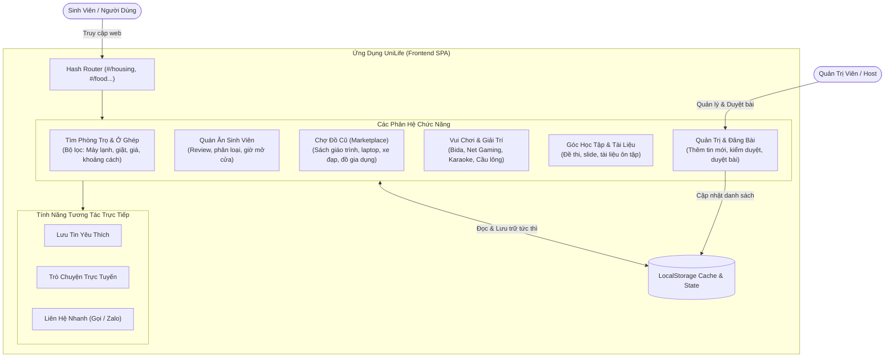
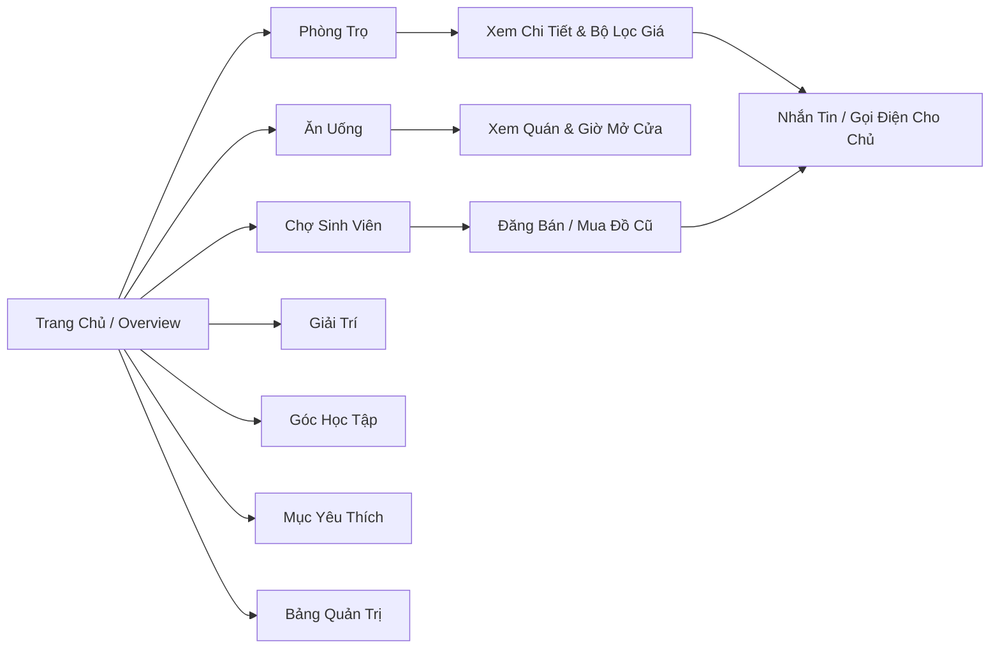

# 🎓 UniLife - Nền Tảng Hỗ Trợ Đời Sống Sinh Viên

UniLife là ứng dụng Web tất-cả-trong-một (All-in-One Platform) dành cho sinh viên, hỗ trợ tìm trọ, quán ăn ngon - bổ - rẻ, trao đổi đồ dùng cũ, tụ điểm giải trí và tài liệu học tập.

---

## 🗺️ Sơ Đồ Kiến Trúc & Luồng Hệ Thống (Architecture & System Flow)

Dưới đây là sơ đồ chi tiết hoạt động của hệ thống UniLife hiển thị trực quan trên GitHub:



---

## 🧭 Sơ Đồ Điều Hướng Ứng Dụng (User Navigation Flow)



---

## ✨ Tính Năng Nổi Bật

- **Tìm trọ thông minh:** Lọc theo khoảng cách, máy lạnh, máy giặt, wifi, bãi gửi xe, mức giá.
- **Ăn uống & Giải trí:** Tổng hợp các địa điểm quanh trường chuẩn tiêu chí ngon - bổ - rẻ.
- **Chợ đồ cũ:** Đăng tin thanh lý sách vở, giáo trình, đồ điện tử nhanh chóng.
- **Chat & Liên hệ:** Tích hợp modal nhắn tin và thông tin liên hệ trực tiếp cho từng tin đăng.
- **Lưu dữ liệu Offline/Local:** Sử dụng `usePersistentState` lưu trực tiếp trên trình duyệt, không lo mất dữ liệu khi tải lại trang (F5).
- **Hoạt động độc lập (Standalone):** Đã đóng gói sẵn bản build production (`index.html` và `assets/`), có thể chạy ngay với bất kỳ web server nào hoặc GitHub Pages.

---

## 🚀 Hướng Dẫn Chạy Sản Phẩm

### 1. Chạy trực tiếp (Bản độc lập đã build sẵn)
Chỉ cần mở file `index.html` thông qua một máy chủ tĩnh (Live Server trong VS Code, `npx serve`, v.v.).

### 2. Chạy môi trường phát triển (Development)
```bash
# Cài đặt thư viện phụ thuộc
npm install

# Khởi chạy server phát triển
npm run dev
```

### 3. Đóng gói cho Production
```bash
npm run build
```
Bản build tối ưu sẽ được xuất ra thư mục `dist/`.

---

## 🛠️ Công Nghệ Sử Dụng

- **Frontend Core:** [React 18](https://react.dev/) + [Vite](https://vitejs.dev/)
- **Icon Library:** [Lucide React](https://lucide.dev/)
- **Kiến trúc:** Single Page Application (SPA), Component-Driven, Client-Side Storage
- **Quản lý phiên bản:** Git & GitHub

---

*Dự án thực hiện bởi Phan Trí Đức - Lớp 24CT1.*
