# 🗄️ Thiết Kế Cơ Sở Dữ Liệu Hệ Thống UniLife (Database Design & ERD)

Tài liệu đặc tả chi tiết Cơ sở dữ liệu quan hệ (Relational Database Management System - RDBMS) của nền tảng hỗ trợ sinh viên UniLife.

File script SQL hoàn chỉnh: [`database/unilife_database.sql`](./unilife_database.sql)

---

## 📊 1. Sơ Đồ Thực Thể - Mối Quan Hệ (Entity-Relationship Diagram - ERD)

Sơ đồ ERD mô hình hóa toàn diện các thực thể dữ liệu và mối quan hệ quan trọng trong hệ thống:

```mermaid
erDiagram
    USERS ||--o{ HOUSING : "dang_bai (1-N)"
    USERS ||--o{ FOOD_PLACES : "so_huu (1-N)"
    USERS ||--o{ MARKETPLACE : "thanh_ly (1-N)"
    USERS ||--o{ STUDY_DOCUMENTS : "chia_se (1-N)"
    USERS ||--o{ USER_FAVORITES : "luu_tin (1-N)"
    USERS ||--o{ REVIEWS : "viet_danh_gia (1-N)"
    USERS ||--o{ MESSAGES : "gui_tin (1-N)"

    USERS {
        bigint id PK "Khoa chinh tu tang"
        varchar name "Ho ten nguoi dung"
        varchar email UK "Email dang nhap duy nhat"
        varchar password_hash "Mat khau ma hoa"
        varchar phone "So dien thoai"
        enum role "Quan tri vien / Khach hang / Chu tro / Chu quan..."
        enum status "Active / Banned / Pending"
        text avatar_url "Link anh dai dien"
        datetime created_at "Ngay tao tai khoan"
    }

    HOUSING {
        bigint id PK "Ma phong tro"
        bigint user_id FK "Chu tro dang bai"
        varchar name "Tieu de phong"
        varchar price "Gia hien thi"
        decimal price_num "Gia so loc tim kiem"
        varchar area "Dien tich phong"
        varchar address "Dia chi phong"
        varchar dist "Khoang cach den truong"
        varchar phone "So hotline lien he"
        tinyint ac "Dieu hoa (1: Co, 0: Khong)"
        tinyint washer "May giat"
        tinyint wifi "Mang Internet"
        tinyint parking "Cho de xe"
        text image_url "Anh thuc te phong tro"
        enum status "approved / hidden / pending"
        datetime created_at "Thoi gian dang"
    }

    FOOD_PLACES {
        bigint id PK "Ma quan an"
        bigint user_id FK "Chu quan dang tin"
        varchar name "Ten quan an"
        varchar cat "Phan loai Com / Bun / Tra sua..."
        varchar price "Khoang gia"
        varchar address "Dia chi quan"
        varchar hours "Gio mo cua"
        decimal rating "Diem danh gia"
        varchar phone "So hotline dat mon"
        text image_url "Anh mon an"
        enum status "approved / hidden / pending"
        datetime created_at "Ngay tao"
    }

    MARKETPLACE {
        bigint id PK "Ma san pham do cu"
        bigint user_id FK "Nguoi ban do"
        varchar name "Ten san pham"
        varchar price "Gia pass lai"
        varchar cond "Tinh trang con moi"
        varchar cat "Danh muc Sach / Gia dung / Dien tu..."
        varchar seller "Ten nguoi ban"
        varchar phone "So Zalo lien he"
        varchar loc "Dia diem giao dich"
        text image_url "Anh san pham"
        enum status "approved / hidden / pending"
        datetime created_at "Ngay dang tin"
    }

    ENTERTAINMENT {
        bigint id PK "Ma dia diem giai tri"
        varchar name "Ten quan net / bida / karaoke"
        varchar cat "The loai giai tri"
        varchar price "Bang gia dich vu"
        varchar address "Dia chi dia diem"
        varchar hours "Gio hoat dong"
        decimal rating "Diem danh gia"
        text image_url "Anh dia diem"
        enum status "approved / hidden"
        datetime created_at "Ngay them"
    }

    STUDY_DOCUMENTS {
        bigint id PK "Ma tai lieu hoc tap"
        bigint user_id FK "Nguoi dong gop"
        varchar title "Tieu de tai lieu / de thi"
        varchar author "Tac gia / giang vien"
        int downloads "So luot tai"
        decimal rating "Diem binh chon"
        varchar doc_type "De thi / Giao trinh / So do..."
        text file_url "Link tai ve PDF"
        text description "Mo ta noi dung"
        datetime created_at "Ngay dang"
    }

    USER_FAVORITES {
        bigint id PK "Ma yeu thich"
        bigint user_id FK "Nguoi dung luu tin"
        enum item_type "housing / food / market / entertainment"
        bigint item_id "ID cua muc duoc luu"
        datetime created_at "Thoi diem luu"
    }

    REVIEWS {
        bigint id PK "Ma danh gia"
        bigint user_id FK "Nguoi viet danh gia"
        enum target_type "housing / food / market / entertainment"
        bigint target_id "ID doi tuong danh gia"
        tinyint rating "So sao (1-5)"
        text comment "Noi dung binh luan"
        datetime created_at "Ngay viet"
    }

    MESSAGES {
        bigint id PK "Ma tin nhan"
        bigint sender_id FK "Nguoi gui"
        bigint receiver_id FK "Nguoi nhan"
        text message "Noi dung tin nhan"
        tinyint is_read "Da doc (1) hoac Chua (0)"
        datetime created_at "Thoi gian gui"
    }
```



---

## 📑 2. Từ Điển Dữ Liệu (Data Dictionary)

### 2.1. Bảng `users` (Người dùng & Tài khoản)
| Tên cột | Kiểu dữ liệu | Ràng buộc | Mô tả |
| :--- | :--- | :--- | :--- |
| `id` | `BIGINT UNSIGNED` | `PRIMARY KEY, AUTO_INCREMENT` | Định danh tài khoản duy nhất |
| `name` | `VARCHAR(150)` | `NOT NULL` | Họ tên hiển thị của người dùng |
| `email` | `VARCHAR(191)` | `NOT NULL, UNIQUE` | Địa chỉ email đăng nhập hệ thống |
| `password_hash` | `VARCHAR(255)` | `NOT NULL` | Mật khẩu tài khoản (hashing) |
| `phone` | `VARCHAR(20)` | `DEFAULT NULL` | Số điện thoại liên hệ |
| `role` | `ENUM(...)` | `DEFAULT 'Khách hàng'` | Vai trò: `Quản trị viên`, `Khách hàng`, `Chủ nhà trọ`, `Chủ quán ăn`, `Người bán đồ cũ` |
| `status` | `ENUM(...)` | `DEFAULT 'Active'` | Trạng thái: `Active`, `Banned`, `Pending` |
| `avatar_url` | `TEXT` | `DEFAULT NULL` | Link ảnh đại diện |
| `created_at` | `DATETIME` | `DEFAULT CURRENT_TIMESTAMP` | Thời điểm tạo tài khoản |

### 2.2. Bảng `housing` (Phòng trọ & Ở ghép)
| Tên cột | Kiểu dữ liệu | Ràng buộc | Mô tả |
| :--- | :--- | :--- | :--- |
| `id` | `BIGINT UNSIGNED` | `PRIMARY KEY, AUTO_INCREMENT` | Mã phòng trọ |
| `user_id` | `BIGINT UNSIGNED` | `FOREIGN KEY REFERENCES users(id)` | Mã chủ phòng đăng bài |
| `name` | `VARCHAR(255)` | `NOT NULL` | Tiêu đề bài đăng phòng |
| `price` | `VARCHAR(50)` | `NOT NULL` | Chuỗi giá hiển thị (VD: 2.2 tr/tháng) |
| `price_num` | `DECIMAL(10,2)` | `NOT NULL` | Giá số dùng để lọc theo khoảng giá |
| `area` | `VARCHAR(50)` | `DEFAULT '20m²'` | Diện tích phòng |
| `address` | `VARCHAR(255)` | `NOT NULL` | Địa chỉ chi tiết |
| `dist` | `VARCHAR(50)` | `DEFAULT '1.2 km'` | Khoảng cách đến trường đại học |
| `phone` | `VARCHAR(20)` | `DEFAULT '0905.123.456'` | Số điện thoại liên hệ xem phòng |
| `ac` | `TINYINT(1)` | `DEFAULT 1` | Có máy lạnh/điều hòa (1: Có, 0: Không) |
| `washer` | `TINYINT(1)` | `DEFAULT 1` | Có máy giặt |
| `wifi` | `TINYINT(1)` | `DEFAULT 1` | Có kết nối internet wifi |
| `parking` | `TINYINT(1)` | `DEFAULT 1` | Có nhà để xe an toàn |
| `image_url` | `TEXT` | `DEFAULT NULL` | URL ảnh phòng trọ chất lượng cao |
| `status` | `ENUM(...)` | `DEFAULT 'approved'` | Trạng thái duyệt: `approved`, `hidden`, `pending` |

### 2.3. Bảng `food_places` (Quán ăn sinh viên)
| Tên cột | Kiểu dữ liệu | Ràng buộc | Mô tả |
| :--- | :--- | :--- | :--- |
| `id` | `BIGINT UNSIGNED` | `PRIMARY KEY, AUTO_INCREMENT` | Mã quán ăn |
| `user_id` | `BIGINT UNSIGNED` | `FOREIGN KEY REFERENCES users(id)` | Mã chủ quán đăng tin |
| `name` | `VARCHAR(255)` | `NOT NULL` | Tên quán ăn |
| `cat` | `VARCHAR(50)` | `NOT NULL` | Phân loại ẩm thực: Cơm, Bún/Phở, Trà sữa, Ăn vặt... |
| `price` | `VARCHAR(100)` | `NOT NULL` | Khoảng giá đồ ăn (VD: 25k - 40k) |
| `address` | `VARCHAR(255)` | `NOT NULL` | Địa chỉ quán |
| `hours` | `VARCHAR(100)` | `DEFAULT '06:30 - 21:00'` | Khung giờ hoạt động |
| `rating` | `DECIMAL(3,2)` | `DEFAULT 4.80` | Đánh giá sao trung bình (1.0 - 5.0) |
| `phone` | `VARCHAR(20)` | `DEFAULT NULL` | Hotline đặt hàng / giao hàng |
| `image_url` | `TEXT` | `DEFAULT NULL` | Hình ảnh món ăn / không gian quán |
| `status` | `ENUM(...)` | `DEFAULT 'approved'` | Trạng thái duyệt: `approved`, `hidden`, `pending` |

### 2.4. Bảng `marketplace` (Chợ đồ cũ sinh viên)
| Tên cột | Kiểu dữ liệu | Ràng buộc | Mô tả |
| :--- | :--- | :--- | :--- |
| `id` | `BIGINT UNSIGNED` | `PRIMARY KEY, AUTO_INCREMENT` | Mã mặt hàng thanh lý |
| `user_id` | `BIGINT UNSIGNED` | `FOREIGN KEY REFERENCES users(id)` | Mã người đăng bán |
| `name` | `VARCHAR(255)` | `NOT NULL` | Tên món đồ thanh lý |
| `price` | `VARCHAR(100)` | `NOT NULL` | Giá bán mong muốn |
| `cond` | `VARCHAR(100)` | `DEFAULT 'Đã dùng - tốt'` | Tình trạng (Mới 99%, Còn tốt...) |
| `cat` | `VARCHAR(50)` | `NOT NULL` | Danh mục: Sách, Đồ điện tử, Gia dụng, Xe máy... |
| `seller` | `VARCHAR(150)` | `NOT NULL` | Tên người bán hiển thị |
| `phone` | `VARCHAR(20)` | `NOT NULL` | Số Zalo / Hotline mua hàng |
| `loc` | `VARCHAR(255)` | `DEFAULT 'Ký túc xá'` | Địa điểm hẹn xem hàng |
| `image_url` | `TEXT` | `DEFAULT NULL` | Ảnh chụp thực tế của sản phẩm |
| `status` | `ENUM(...)` | `DEFAULT 'approved'` | Trạng thái: `approved`, `hidden`, `pending` |

### 2.5. Bảng `user_favorites` (Mục yêu thích đã lưu)
| Tên cột | Kiểu dữ liệu | Ràng buộc | Mô tả |
| :--- | :--- | :--- | :--- |
| `id` | `BIGINT UNSIGNED` | `PRIMARY KEY, AUTO_INCREMENT` | Mã mục yêu thích |
| `user_id` | `BIGINT UNSIGNED` | `FOREIGN KEY REFERENCES users(id)` | Người dùng đã thả tim / lưu tin |
| `item_type` | `ENUM(...)` | `NOT NULL` | Loại mục: `housing`, `food`, `market`, `entertainment` |
| `item_id` | `BIGINT UNSIGNED` | `NOT NULL` | ID của mục tương ứng |
| `created_at` | `DATETIME` | `DEFAULT CURRENT_TIMESTAMP` | Thời điểm thả tim |

---

## ⚙️ 3. Hướng Dẫn Cài Đặt & Sử Dụng CSDL

### Cách 1: Sử dụng MySQL Command Line
```bash
mysql -u root -p < database/unilife_database.sql
```

### Cách 2: Sử dụng phpMyAdmin / DBeaver / Navicat
1. Mở phpMyAdmin hoặc DBeaver, kết nối đến Database Server.
2. Chọn menu **Import** (hoặc mở New SQL Script).
3. Chọn file [`database/unilife_database.sql`](./unilife_database.sql) và nhấn **Execute (Chạy)**.
4. Hệ thống sẽ tự động khởi tạo database `unilife_db`, tạo 9 bảng và nạp sẵn dữ liệu mẫu (seed data) hoàn chỉnh.
